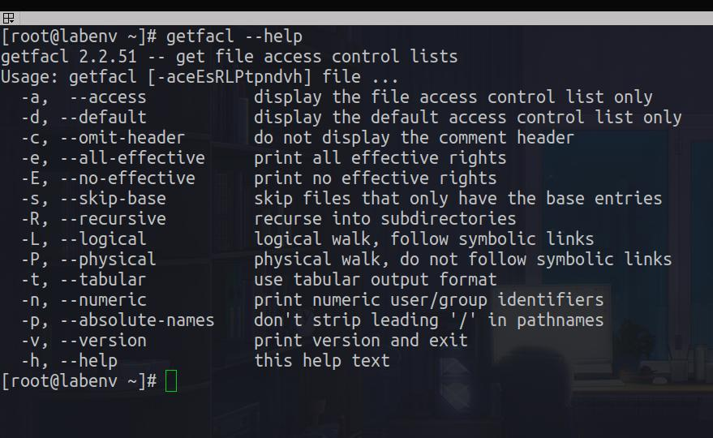

# 6. Access Control List

<div align="center">
  
</div>

---

---

## Outline

#### 6.1 viewing the current ACL

#### 6.2 setting an ACL

---

### ACL: Access Control List

What is ACL ?
Access control list (ACL) provides an additional, more flexible permission mechanism for file systems. It is designed to assist with UNIX file permissions. ACL allows you to give permissions for any user or group to any disc resource.

Use of ACL :
Think of a scenario in which a particular user is not a member of group created by you but still you want to give some read or write access, how can you do it without making user a member of group, here comes in picture Access Control Lists, ACL helps us to do this trick.

Basically, ACLs are used to make a flexible permission mechanism in Linux.

From Linux man pages, ACLs are used to define more fine-grained discretionary access rights for files and directories.

#### Requirements:

1. Kernal must support acl

   ```bash

   cat /boot/config-3.10.0-1160.102.1.el7.x86_64 | grep -i "acl"
   ```

2. File system must support acl

- xfs support acl by default
- ext4 should remount with acl option

  ```bash

  blkid

  # mount with acl option
  mount -o acl /dev/sdb1 /media

  # remount with acl option
  mount -o remount,acl /media
  ```

- check if file system support acl

  ```bash

  dumpe2fs /dev/sdb1 | grep -i "acl"
  ```

<div align="center">
  
</div>

<br>
<br>

## 6.1 viewing the current ACL

```bash

getfacl --help
```

<div align="center">
  
</div>

<br>
<br>

```bash

getfacl file.txt
```

<div align="center">
  
</div>

---

#### 6.2 setting an ACL

```bash

setfacl --help
```

<div align="center">
  
</div>

<br>
<br>

```bash

# set user rwx permission on file.txt
setfacl -m u:use1:rwx file.txt
```

<div align="center">
  
</div>

<br>
<br>

```bash

# set user rwx as __default__ permission  on file.txt
setfacl -R -m d:u:use1:rwx dir1/
```

<div align="center">
  
</div>

<br>
<br>

```bash

# [ 'b' remove all permisions + 'k' remove default permissions] with 'R' recursive
setfacl -Rbk dir1/
```

<div align="center">
  
</div>

---

## [Outlines](../README.md)
