# 2. Groups

  

---

---

## Outline

#### 2.1 Create Group

#### 2.2 Modify Group

#### 2.3 Delete Group

#### 2.4 Assign user to Primary and Secondary group

#### 2.5 List all members in group

#### 2.6 Remove members from group

---

## Types of Groups in Linux System

#### 1. Primary Group

**_A primary group is automatically created when a user with a unique user ID is created._**

#### 2. Secondary Group

**_A secondary group is created by using commands. You can change the group IDs of the users and add them to this group later._**

### Login defines variables

**`cat /etc/login.defs`**

  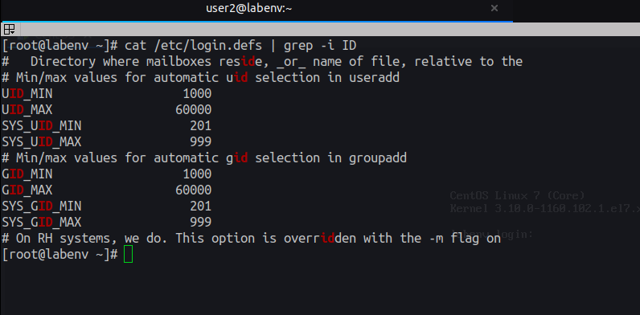

### Groups stored in group file

**`cat /etc/group`**

  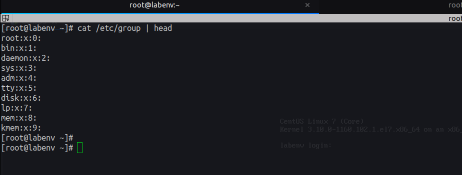

### Group passwords stored in passwd file

**`cat /etc/shadow`**

  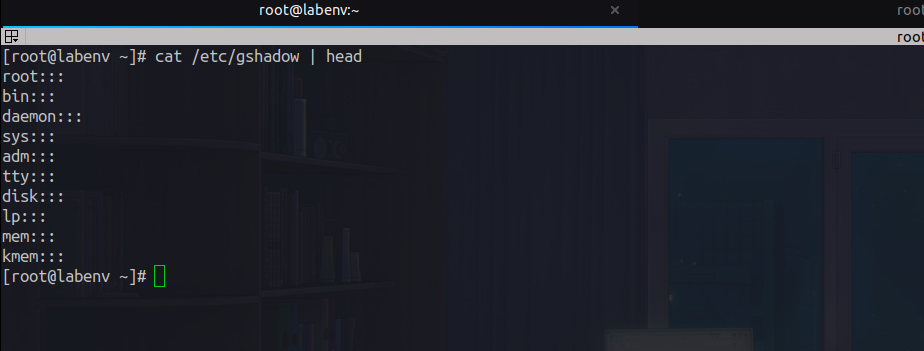

---

## Create User

**`groupadd GROUP_NAME`**
**`groupadd --help`**

  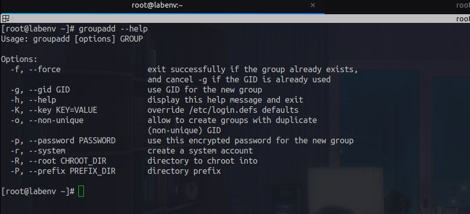

 

**`groupadd user1`**

  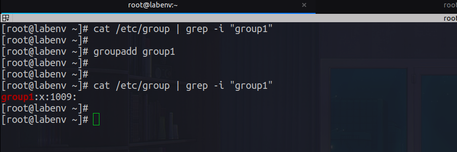

---

---

## Modify Group info

**`groupmod OPTION GROUP_NAME`**
**`groupmod --help`**

  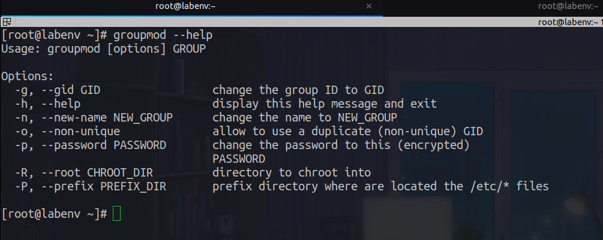

 

**`groupmod -g 1111 group1`**

  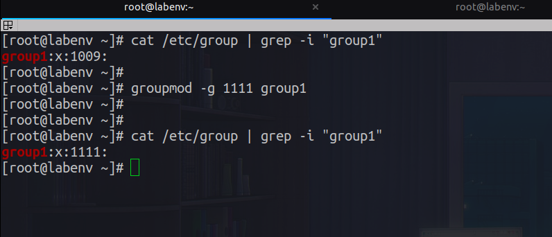

 

---

## Delete Group

**`groupdel GROUP_NAME`**
**`groupdel --help`**

  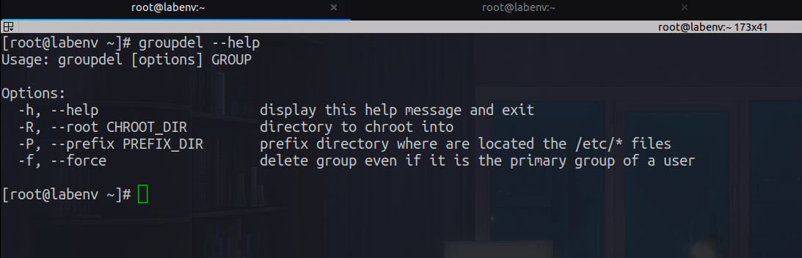

 

**`groupdel group1`**

  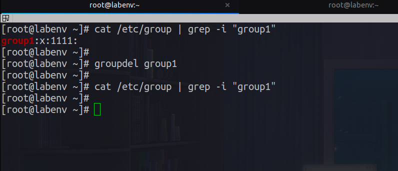

---

#### 2.4 Assign user to Primary and Secondary group

##### 2.4.1 Assign user to Primary Group

**`usermod -g GROUP_NAME USER_NAME`**

  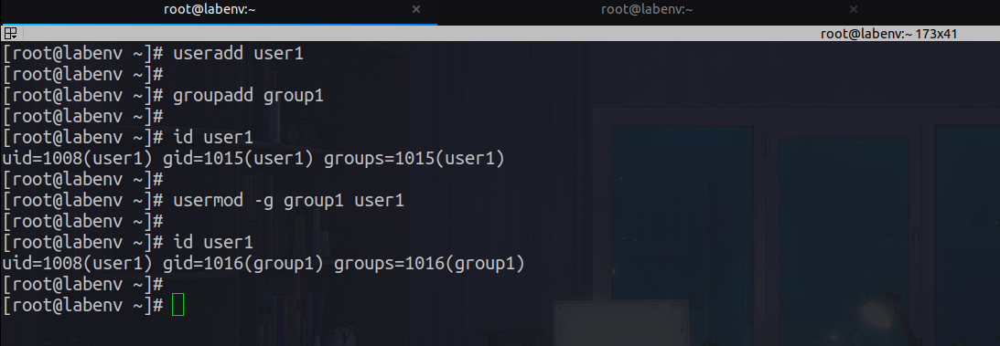

 

##### 2.4.2 Assign user to Secondary Group

**`usermod -G GROUP_NAME USER_NAME`**

  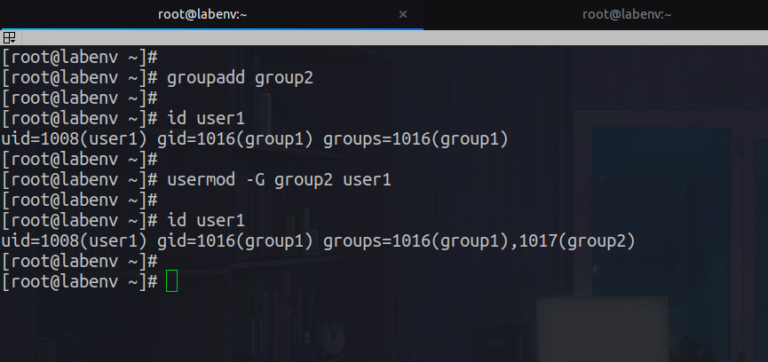

 

##### 2.4.3 Assign user to Multiple Secondaries Group

**`usermod -aG GROUP_NAME USER_NAME`**

  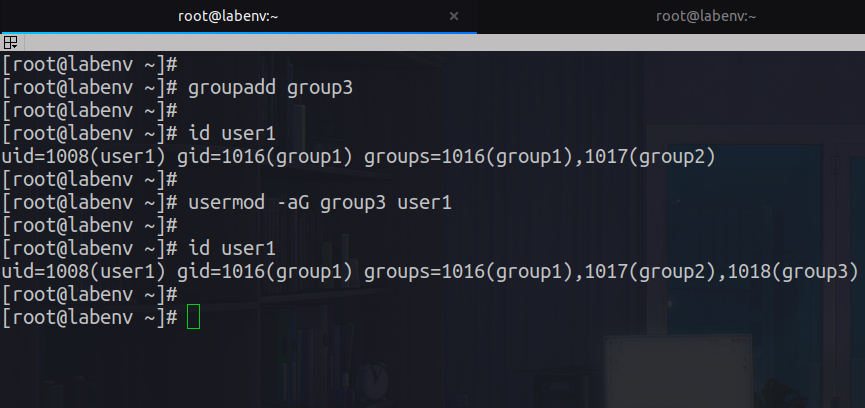

---

#### 2.5 List all members in group

##### Package:`libuser`:_user and group account administration library - utilities_

**debian:`apt install libuser`**
**redhat:`yum install libuser.x86_64`**

  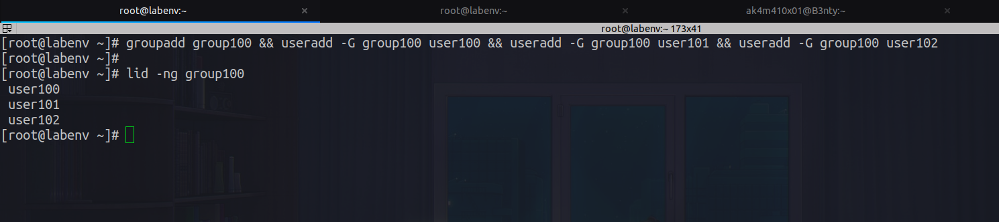

---

#### 2.6 Remove members from group

  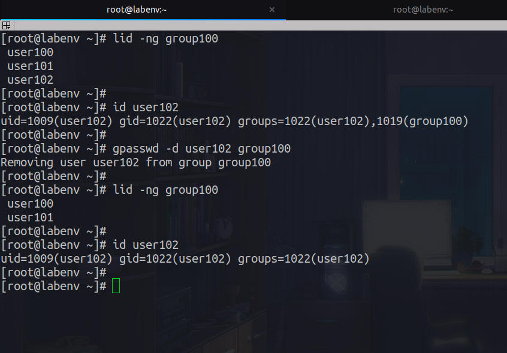

---

## [Outlines](../README.md)
