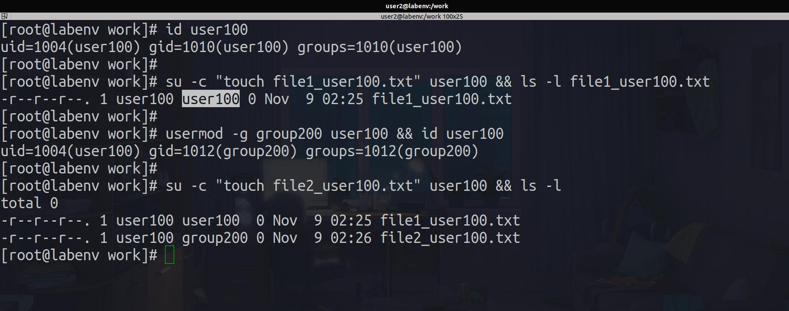
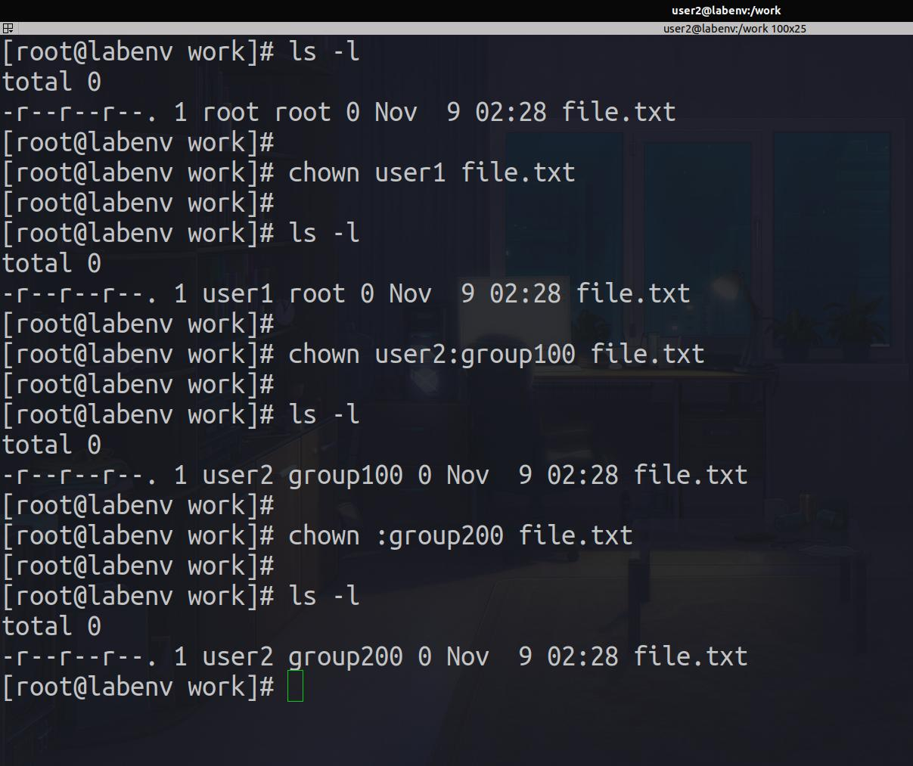
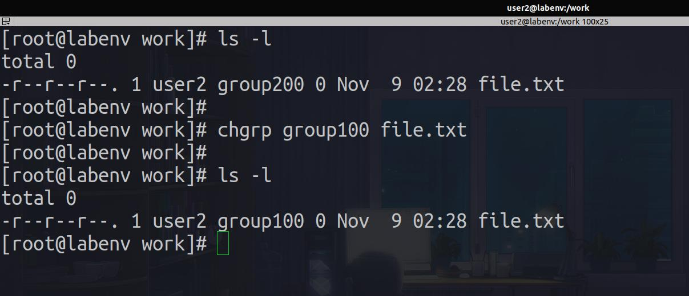

# 4. Ownership

<div align="center">
  
</div>

---

---

## Outline

#### 1.1 User Ownership

#### 2.2 Group Ownership

---

<div align="center">
  
</div>

### 1.1 User Ownership

**_All Linux files belong to an owner and a group. When permissions and users are represented by letters, that is called symbolic mode. For users, u stands for user owner, g for group owner, and o for others. For permissions, r stands for read, w for write, and x for execute._**

```bash


chown user1 file.txt

chown user2:group200 file.txt

chown :group100 file.txt
```

<div align="center">
  
</div>

<br>
<br>

### 1.1 Group Ownership

**_All Linux files belong to an owner and a group. When permissions and users are represented by letters, that is called symbolic mode. For users, u stands for user owner, g for group owner, and o for others. For permissions, r stands for read, w for write, and x for execute._**

```bash


chgrp group100 file.txt
```

<div align="center">
  
</div>

---

## [Outlines](../README.md)
