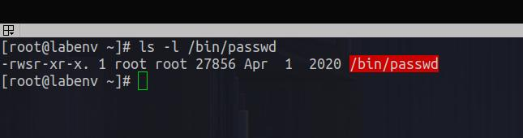

# 3. Permission

<div align="center">
  
</div>

---

---

## Outline

#### 3.1 Symbolic Method

#### 3.2 Numeric Method

#### 3.3 Special Permissions

#### 3.4 Default Permissions

---

_**Linux is a multi-user operating system, so it has security to prevent people from accessing each other’s confidential files. when you execute a “ls” command, you are not given any information about the security of the files, because by default “ls” only lists the names of files. You can get more information by using an “option” with the “ls” command. All options start with a ‘-‘. For example, to execute “ls” with the “long listing” option, you would type ls -l When you do so, each file will be listed on a separate line in a long format. There is an example in the window below.**_

#### Syntax:

1. The first character = ‘-‘, which means it’s a file ‘d’, which means it’s a directory.
2. The next nine characters = (rw-r–r–) show the security
3. The next column shows the owner of the file. (Here it is `root`)
4. The next column shows the group owner of the file. (Here it is `root` which has special access to these files)
5. The next column shows the size of the file in bytes.
6. The next column shows the date and time the file was last modified.
7. Last Column = File_name or Directory_name. (For example, here are: prac, snap, test, example)

<div align="center">
  
</div>

<br>
<br>

#### Security permissions in Linux

##### Read, write, and execute.

```


---     ---     ---
rwx     rwx     rwx
user    group   other

```

##### Read, write, and execute.

| Letter | Definition                                                                  |
| ------ | --------------------------------------------------------------------------- |
| `r`    | 'read' the file’s contents.                                                 |
| `w`    | 'write', or modify, the file’s contents.                                    |
| `x`    | 'execute' the file. This permission is given only if the file is a program. |

<br>
<br>

##### Symbols: `+`, `-` and `=`

| Letter | Definition                                    |
| ------ | --------------------------------------------- |
| `+`    | 'Add' permissions                             |
| `-`    | 'Remove' permissions                          |
| `=`    | 'Set' the permissions to the specified values |

<br>
<br>

##### User, group, and others

| Reference | Class | Description                                                                                                                                     |
| --------- | ----- | ----------------------------------------------------------------------------------------------------------------------------------------------- |
| `u`       | user  | The user permissions apply only to the owner of the file or directory, they will not impact the actions of other users.                         |
| `g`       | group | The group permissions apply only to the group that has been assigned to the file or directory, they will not affect the actions of other users. |
| `o`       | other | The other permissions apply to all other users on the system, this is the permission group that you want to watch the most.                     |
| `a`       | all   | All three (owner, groups, others)                                                                                                               |

<br>
<br>

## 3.1 Symbolic Method

#### Syntax:

```bash


touch file.txt
# default: rw- rw- r--

chmod o+x file.txt
# begin: rw- rw- rw-


chmod o-rx file.txt
# begin: rw- rw- -w-


chmod w+rx file.txt
# begin: rw- -w- -w-


chmod u+rwx file.txt
# begin: rwx -w- -w-


chmod u+rwx,g-rwx,o-rwx file.txt
# begin: rwx --- ---

chmod u=rwx,g=rwx,o=rwx file.txt
# begin: rwx rwx rwx

chmod a=rwx file.txt
# begin: rwx rwx rwx


chmod a-wx file.txt
# begin: r-- r-- r--


```

---

## 3.1 Numeric Method

#### Syntax:

```bash


touch file.txt
# default: rw- rw- r--


chmod 770 file.txt
# begin: rwx rwx ---


chmod 771 file.txt
# begin: rwx rwx --x


chmod 772 file.txt
# begin: rwx rwx -w-


chmod 773 file.txt
# begin: rwx rwx -wx


chmod 774 file.txt
# begin: rwx rwx r--


chmod 775 file.txt
# begin: rwx rwx r-x


chmod 776 file.txt
# begin: rwx rwx rw-


chmod 772 file.txt
# begin: rwx rwx rwx


```

---

## 3.4 Special Permissions

**_Special permissions in Linux, including SUID, SGID, and the sticky bit, provide additional control and flexibility over file and directory access. SUID allows users to temporarily assume the privileges of the file owner, while SGID enables temporary group ownership._**

| Special Permissions | Effect on FILES                                                              | Effect on Directory                                                                                         |
| ------------------- | ---------------------------------------------------------------------------- | ----------------------------------------------------------------------------------------------------------- |
| u+s (SUID)          | Files execute as the user that owns the file, not the user that run the file | Not Effect                                                                                                  |
| g+s (SGID)          | Files execute as the **_group_** that owns the file                          | Files newly created in the directory have thier group owner set to match the group owner of the directory   |
| o+t (Sticky bit)    | No Effect                                                                    | Users with write access to the directory can only remove or force saves to the files owned by others users. |

### SUID

**_Effect on Files: Files execute as the user that owns the file, not the user that run the file._**

##### Scenario:

###### 1. CREATE USER='abdullah'

###### 2. SET PASSWORD='P@ssw0rd' FOR USER='abdullah'

###### 3. SHOW SHADOW FILE='/etc/password' PERMISSIONS AND HASHED_PASSWORD FOR USER='abdullah'

###### 4. SWITCH FOR USER='abdullah' AND CHANGE PASSWORD='Zqa$/321'

###### 5. SWITCH FOR USER='root'

###### 6. SHOW HASHED_PASSWORD FOR USER='abdullah' IT CHANGED...

<div align="center">
  
</div>

##### Answer to scenario

###### **The Command `password==/bin/passwd` has a SUID permissions. **

<div align="center">
  
</div>

##### Scenario:

###### 1. Remove SUID from /bin/passwd

###### 2. SWITCH to USER='abdullah'

###### 3. TRY to CHANGE password to Complex password='WlEz^2!0'

<div align="center">
  
</div>

##### You Found error

<br>
<br>
<br>

### SGID

#### Effect on Files

**_Files execute as the group that owns the file_**

<div align="center">
  
</div>

<br>

#### Effect on Dirs

**_Files newly created in the directory have thier group owner set to match the group owner of the directory_**

<div align="center">
  
</div>

<br>
<br>

### SGID

**_Users with write access to the directory can only remove or force saves to the files owned by others users._**

<div align="center">
  
</div>

#### Change special Permissions

```bash


touch file.txt

# SUID
chmod u+s file.txt

# SGID
chmod g+s file.txt

# Sticky bit
chmod o+t file.txt

# SUID=4
# SGID=2
# Sticky=1

# chmod X### [file || directory]

# SUID
chmod 4744 file.txt

# SGID
chmod 2744 file.txt

# Sticky
chmod 1744 file.txt


```

---

## 3.3 Default Permissions

**_When you create a new file or dir it is assigned initial permissions. There are two things that affect these initial permissions._**

#### The umask Command Syntax

**Using the umask command without additional command options returns the current mask as the output:**

<div align="center">
  
</div>

**The umask command uses the following syntax:**

#### ROOT UMASK: 022

022 <br>
000 010 010 <br>
111 101 101 <br>
rwx r-x r-x: Dirs <br>
rw- r-- r--: Files

#### Normal User UMASK: 002

002 <br>
000 000 010 <br>
111 111 101 <br>
rwx rwx r-x: Dirs <br>
rw- rw- r--: Files

```bash


umask [-p] [-S] [mask]

```

- `[mask]`: The new permissions mask you are applying. By default, the mask is presented as a numeric (octal) value.
- `[-S]`: Displays the current mask as a symbolic value.
- `[-p]`: Displays the current mask along with the umask command, allowing it to be copied and pasted as a future input.

<div align="center">
  
</div>

#### Where:

#### How to Set and Update the Default Umask Value

**Use the following syntax to apply a new umask value:**

```bash


umask [mask]

umask u=rw,g=rw,o=r

umask 662

```

<div align="center">
  
</div>

#### Don't forget write this value in .bashrc || .profile

```bash


echo "umask 662" >> ~/.bashrc

#########  OR  #########

echo "umask 662" >> ~/.bash_profile

```

---

## [Outlines](../README.md)
