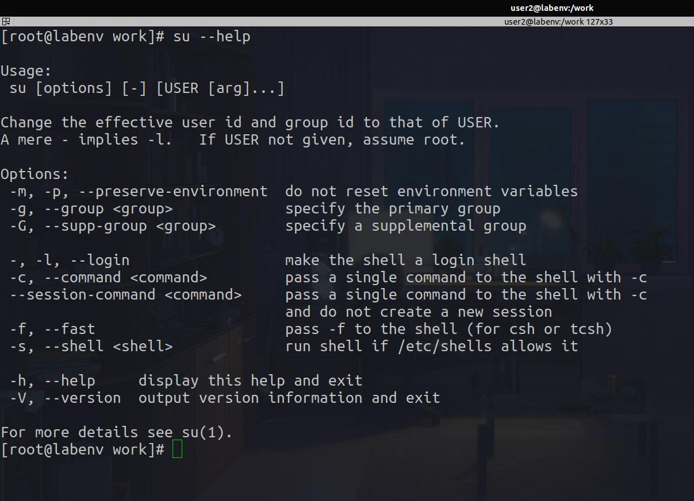
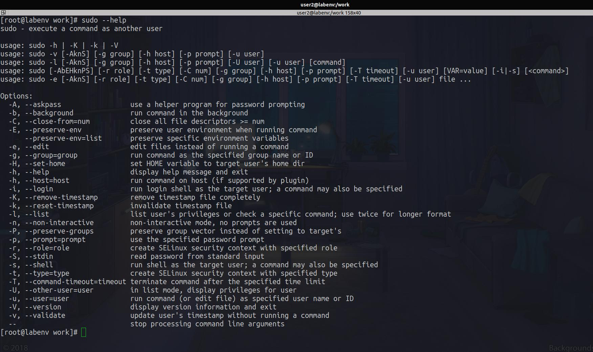

# 4. Sudoers

<div align="center">
  
</div>

---

---

## Outline

#### 4.1 SU

#### 4.2 Sudo

---

## 4.1 SU: switch user

**_Su allows users to switch to the root account and perform administrative tasks, while sudo allows users to execute specific commands with elevated privileges_**

<div align="center">
  
</div>

```bash

# Usage:
#  su [options] [-] [USER [arg]...]

# Switch user
## swtich user and go to his home dir
su - user1
## swtich user and still in you location
su user

# Excute command with another user permissions [without login]
su -c "id" user1

# switch user with specified shell (if exists in /etc/shells)
su -s /bin/sh user1

# switch to a user using the specified user's environment variables
su -l user1


```

---

## 4.1 SUDO: Super User do

**_Sudo is a command-line utility for Unix and Unix-based operating systems such as Linux and macOS. The utility provides an efficient way to temporarily grant users or user groups privileged access to system resources so that they can run commands that they cannot run under their regular accounts._**

#### Grant Superuser Access

<br>

```bash

# access denied actions saved in ...
cat /var/log/secure

# sudoers config file
cat /etc/sudoers.conf

visudo

john ALL:(ALL) ALL:ALL
```

**_The sudoers file is a critical configuration file on Linux systems that controls who can use the sudo command to execute commands with elevated privileges. The sudo command allows non-root users to run commands that would normally require root access. The sudoers file contains entries that specify which users can use sudo, what commands they can run, and what options they can use._**

<br>

**The line `john ALL=(ALL) ALL` in the sudoers file grants the user `john` unlimited sudo privileges. This means that `john` can run any command with sudo, without any restrictions. The `ALL` keyword in the first set of parentheses means that `john` can run commands on any host, and the `ALL` keyword in the second set of parentheses means that john can run any command.**

<br>

##### Here is a breakdown of the line:

- `john`: This is the username of the user to whom the entry applies.
- `ALL=(ALL)`: This specifies the host and command invocations allowed for the user.
  - `ALL`: This means that the user can run commands on any host.
  - `(ALL)`: This means that the user can run any command.
- `ALL`: This specifies the options allowed for the user.
  - `ALL`: This means that the user can use any options with sudo.

<br>

<div align="center">
  
</div>

---

## [Outlines](../README.md)
