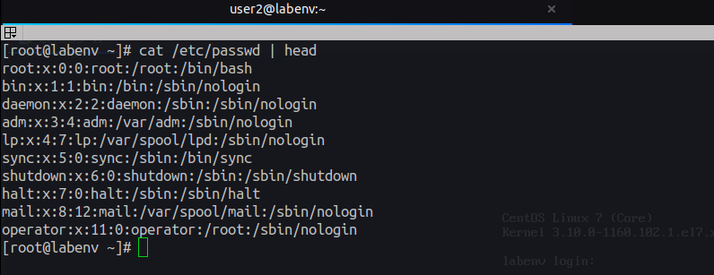

# 1. Users

## Outline

#### 1.1 Create User

#### 2.2 Modify User

#### 3.2 Delete User

---

## Types of Users in Linux System

#### 1. Super User: root

**_Root is the superuser account in Unix and Linux. It is a user account for administrative purposes, and typically has the highest access rights on the system. Usually, the root user account is called root ._**

**UID = 0**

#### 2. Normal User

**_Normal users are human users created by root or another user with root privileges. Each normal user has a login shell and a home directory to store their files._**

**1_000 <= UID >= 60_000**

#### 3. Service User

**_Unix and Linux service accounts are known as init or inetd. They are a type of non-human privileged account that can execute applications and run automated services, virtual machine instances, and other processes._**

**1 <= UID <= 999**

### Login defines variables

**`cat /etc/login.defs`**

  

### Users stored in passwd file

**`cat /etc/passwd`**

  

### Passwords stored in passwd file

**`cat /etc/shadow`**

  

---

## Create User

**`useradd USERNAME`**
**`useradd --help`**

  

 

**`useradd user1`**

  

---

## Modify User info

**`usermod OPTION USERNAME`**
**`usermod --help`**

  

 

**`usermod -s /bin/sh user1`**

  

 

### Set password for any user to login

**`passwd user1`**

  

---

## Delete User

**`userdel USERNAME`**
**`userdel --help`**

  

 

**`userdel -r user1`**

  

---

## [Outlines](../README.md)
